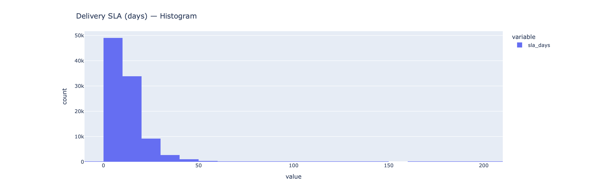

# E-commerce Sales Funnel Dashboard

## Live

- Dashboard: https://kachowska.github.io/olist-funnel-dashboard/
- A/B test report: https://kachowska.github.io/olist-funnel-dashboard/abtest.html


This project analyzes the Olist Brazilian e-commerce dataset and produces a reproducible sales-funnel dashboard. It demonstrates an end-to-end workflow: ETL → feature engineering → business metrics → static Plotly HTML dashboard, plus a mock A/B test write-up.

## Dataset
Brazilian E-Commerce Public Dataset by Olist (Kaggle).
Download steps are in the “Quickstart” section.

## Objectives
- Describe the customer journey: created → approved (paid) → delivered_carrier → delivered_customer.
- Quantify step-wise conversion and overall funnel conversion.
- Track weekly KPIs: orders, delivered orders, revenue, AOV.
- Explore payment mix, category revenue, geography, delivery SLA.
- Provide a mock A/B test (banner) with a power analysis.

## Project Structure

olist-funnel-dashboard/
├─ src/ # ETL and metric helpers
│ ├─ etl.py
│ ├─ metrics.py
│ ├─ export_csvs.py
│ ├─ export_pngs.py
├─ dashboards/
│ ├─ generate_dashboard.py # builds docs/index.html (Plotly)
│ ├─ generate_abtest_mock.py# builds docs/abtest.html
├─ data/
│ ├─ raw/ # Kaggle CSVs (not tracked by git)
│ └─ processed/ # Parquet outputs
├─ docs/
│ ├─ index.html # static dashboard (hosted by GitHub Pages)
│ └─ abtest.html # mock A/B report
├─ assets/
│ └─ img/ # screenshots used below
└─ README.md


## Screenshots
> The live dashboard is interactive; below are static previews.  
> If your filenames differ, update the paths accordingly.

| Overview | Weekly KPIs |
|---|---|
|  |  |

| AOV | Payment Mix |
|---|---|
|  |  |

| Top Categories | SLA Histogram | Top Cities | Cohort Retention |
|---|---|---|---|
|  |  |  |  |

## Quickstart (local)
```bash
# 1) Create venv and install deps
python3 -m venv .venv
source .venv/bin/activate
pip install -r requirements.txt

# 2) Download data from Kaggle
mkdir -p data/raw
kaggle datasets download -d olistbr/brazilian-ecommerce -p data/raw
unzip -o data/raw/brazilian-ecommerce.zip -d data/raw

# 3) Build processed data and dashboards
python3 src/etl.py
python3 dashboards/generate_dashboard.py
python3 dashboards/generate_abtest_mock.py

# Open:
# docs/index.html (dashboard)
# docs/abtest.html (A/B test report)

Streamlit (optional, interactive)

streamlit run app.py

A/B Test mock
Assignment: 50/50 split via a hash of order_id.
Metric: delivered to customer.
Test: one-sided z-test (B > A).
Power: sample size per group for baseline p and MDE +2pp using statsmodels.
Author
Katsiaryna Pukhouskaya — Junior Data Analyst (Kraków, Poland)
GitHub: https://github.com/kachowska

